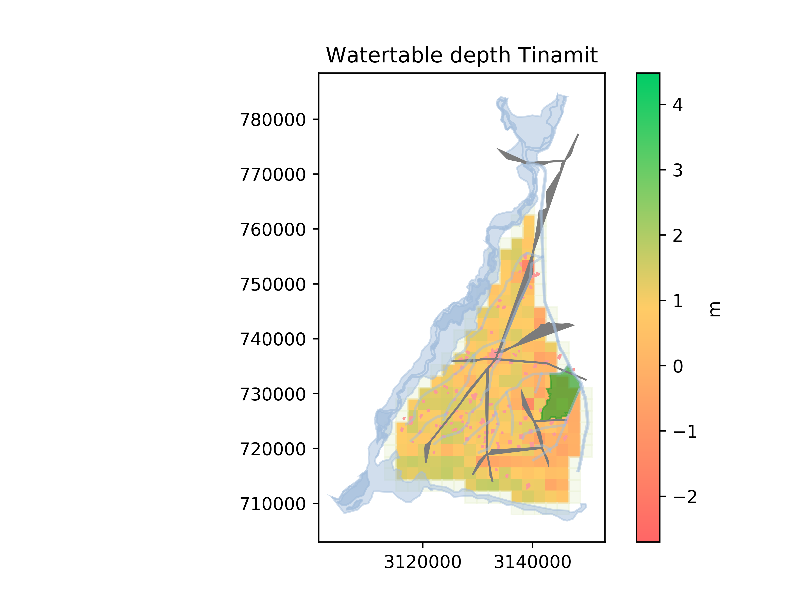

.. _ejemplo_sal:

Ejemplo de salinidad de suelos en Pakistán
==========================================

Preparación
-----------
La mayoría de modelos biofísicos necesitan un modelo externo que instalas separadamente en tu computadora.
Pero el problema es que la gente suele instalar cosas en lugares distintos en sus computadoras. Por eso no puedes
referenciar la envoltura BF sí misma directamente, sino crear una implementación de esta envolutra que especifica
el directorio del modelo SAHYSMOD y del archivo de datos iniciales (el cual determina nuestro modelo, incluso el
número de polígonos, las propiedades hidrológicas de la cuenca, y las condiciones iniciales). Todo este se incluye
en un archivo separado (``SAHYSMOD.py`` en el ejemplo) para facilitar su importación en el IGU. ::

    # Importar lo que importa
    import os

    from tinamit.EnvolturaBF.en.SAHYSMOD.SAHYSMOD_Wrapper import ModeloSAHYSMOD

    # Ruta del archivo ejecutable SAHYSMOD. Cambiar según su computadora.
    SAHYSMOD = 'C:\\SahysMod\\SahysModConsole.exe'

    # Ruta al archivo in datos iniciales de SAHYSMOD. Cambiar según su computadora.
    directorio = os.path.dirname(__file__)
    datos_inic = os.path.join(directorio, 'INPUT_EXAMPLE2.inp')

    # Creamos una envoltura específica a la computadora y la cuenca hidrológica. No cambiar esta línea.
    class Modelo(ModeloSAHYSMOD):
        def __init__(self):
            super().__init__(sayhsmod_exe=SAHYSMOD, initial_data=datos_inic)

Correr la simulación
--------------------
Primero, y en otro archivo Python, importamos todo::

    import os
    
    from tinamit.Conectado import Conectado
    from tinamit.Geog.Geog import Lugar, Geografía

Ahora, especificamos la geografía para el lugar. ::

    Rechna_Doab = Geografía(nombre='Rechna Doab')

    base_dir = os.path.join(os.path.dirname(os.path.realpath(__file__)), 'Shape_files')
    Rechna_Doab.agregar_regiones(os.path.join(base_dir, 'Internal_Polygon.shp'), col_orden='Polygon_ID')

    Rechna_Doab.agregar_objeto(os.path.join(base_dir, 'External_Polygon.shp'), color='#edf4da')
    Rechna_Doab.agregar_objeto(os.path.join(base_dir, 'RIVR.shp'), tipo='agua')
    Rechna_Doab.agregar_objeto(os.path.join(base_dir, 'CNL_Arc.shp'), tipo='agua', llenar=False)
    Rechna_Doab.agregar_objeto(os.path.join(base_dir, 'Forst_polygon.shp'), tipo='bosque')
    Rechna_Doab.agregar_objeto(os.path.join(base_dir, 'buildup_Polygon.shp'), tipo='ciudad')
    Rechna_Doab.agregar_objeto(os.path.join(base_dir, 'road.shp'), tipo='calle')

Establecemos unas políticas, cada una de cuales implica valores distintos para variables distintos del modelo. ::

    usar_senc = True  # El usuario especifica cuál grupo de políticas quiere

    corridas_senc = {'CWU': {'Capacity per tubewell': 100.8, 'Fw': 0.8, 'Policy Canal lining': 0,
                           'Policy RH': 0, 'Policy Irrigation improvement': 0},
                     'VD': {'Capacity per tubewell': 153.0, 'Fw': 0.8, 'Policy Canal lining': 0,
                            'Policy RH': 0, 'Policy Irrigation improvement': 0},
                     'CL': {'Capacity per tubewell': 0, 'Fw': 0, 'Policy Canal lining': 1,
                            'Policy RH': 0, 'Policy Irrigation improvement': 0},
                     'RWH': {'Capacity per tubewell': 0, 'Fw': 0, 'Policy Canal lining': 0,
                             'Policy RH': 1, 'Policy Irrigation improvement': 0},
                     'PIM': {'Capacity per tubewell': 0, 'Fw': 0, 'Policy Canal lining': 0,
                             'Policy RH': 0, 'Policy Irrigation improvement': 1}
                     }

Generamos otro diccionario para combinaciones de las políticas arriba::

    ops = {
        'Capacity per tubewell': [153.0, 100.8],
        'Fw': [0.8, 0],
        'Policy Canal lining': [0, 1],
        'Policy RH': [0, 1],
        'Policy Irrigation improvement': [0, 1]
    }

    corridas_complejas = {}

    for cp in ops['Capacity per tubewell']:
        for fw in ops['Fw']:
            for cl in ops['Policy Canal lining']:
                for rw in ops['Policy RH']:
                    for ir in ops['Policy Irrigation improvement']:
                        nombre_corrida = 'TC {}, Fw {}, CL {}, RW {}, II {}'.format(
                            cp, fw, cl, rw, ir
                        )

                        corridas_complejas[nombre_corrida] = {
                            'Capacity per tubewell': cp,
                            'Fw': fw,
                            'Policy Canal lining': cl,
                            'Policy RH': rw,
                            'Policy Irrigation improvement': ir
                        }

Ahora, creamos el modelo. ::

    modelo = Conectado()

    modelo.estab_mds(os.path.join(os.path.split(__file__)[0], 'Tinamit_sub_v4.vpm'))
    modelo.estab_bf(os.path.join(os.path.split(__file__)[0], 'SAHYSMOD.py'))

.. note::
   Referenciamos la implementación local del modelo biofísico (ver arriba), y no la envoltura sí misma directamente,
   para poder especificar el directorio del modelo SAHYSMOD y del archivo de datos iniciales en esta computadora.

Visto que el modelo DS tiene un paso no estándar de ``estación`` (6 meses), tenemos que establecer la conversión de
unidades de tiempo explícitamente::

    modelo.estab_conv_tiempo(mod_base='mds', conv=6)

Conectamos los variables::

    modelo.conectar(var_mds='Soil salinity Tinamit CropA', mds_fuente=False, var_bf="CrA - Root zone salinity crop A")
    modelo.conectar(var_mds='Soil salinity Tinamit CropB', mds_fuente=False, var_bf="CrB - Root zone salinity crop B")
    modelo.conectar(var_mds='Watertable depth Tinamit', mds_fuente=False, var_bf="Dw - Groundwater depth")
    modelo.conectar(var_mds='ECdw Tinamit', mds_fuente=False, var_bf='Cqf - Aquifer salinity')
    modelo.conectar(var_mds='Lc', mds_fuente=True, var_bf='Lc - Canal percolation')
    modelo.conectar(var_mds='Ia CropA', mds_fuente=True, var_bf='IaA - Crop A field irrigation')
    modelo.conectar(var_mds='Ia CropB', mds_fuente=True, var_bf='IaB - Crop B field irrigation')
    modelo.conectar(var_mds='Gw', mds_fuente=True, var_bf='Gw - Groundwater extraction')
    modelo.conectar(var_mds='Irrigation efficiency', mds_fuente=True, var_bf='FsA - Water storage efficiency crop A')
    modelo.conectar(var_mds='Fw', mds_fuente=True, var_bf='Fw - Fraction well water to irrigation')

Ahora, corremos el modelo con el grupo de políticas que escogió el usuario::

    if usar_senc:
        corridas = corridas_senc
    else:
        corridas = corridas_complejas

    # Corremos el modelo para cada
    for nombre, corrida in corridas.items():

        print('Simulando corrida {}.'.format(nombre))

        # Aplicamos las políticas
        for var_pol, val in corrida.items():
            modelo.mds.inic_val(var=var_pol, val=val)

        # Simulamos el modelo conectado
        modelo.simular(paso=1, tiempo_final=240, nombre_corrida=nombre)  # paso y tiempo final en meses

        # Dibujar mapas
        modelo.dibujar(geog=Rechna_Doab, corrida=nombre, var='Watertable depth Tinamit', directorio='Mapas')
        modelo.dibujar(geog=Rechna_Doab, corrida=nombre, var='Soil salinity Tinamit CropA', directorio='Mapas')

Esto nos da mapas muy bonitos de los egresos del modelo a distintos pasos. Por ejemplo,

   Mapa espacial de la profunididad de la capa fréatica después de 11 pasos de simulación.

Ahora, repetimos las corridas anteriores, pero con cambios climáticos. Primero, establecemos el lugar
y sus observaciones::

    location = Lugar(lat=32.178207, long=73.217391, elev=217)
    location.observar_mensuales('مشاہدہ بارش.csv', meses='مہینہ', años='سال',
                                cols_datos={'Precipitación': 'بارش (میٹر)'})

Y corremos el modelo con combinaciones de cada política y escenario climático del IPCC::

    for rcp in [2.6, 4.5, 6.0, 8.5]:
        print('Simulando con rcp {}\n************'.format(rcp))

        for nombre, corrida in corridas.items():

            print('\tRuning model {}.'.format(nombre))

            # Set appropriate var_poles for policy analysis
            for var_pol, val in corrida.items():
                modelo.mds.inic_val(var=var_pol, val=val)

            modelo.simular(paso=1, tiempo_final=50 * 2, fecha_inic=1990, lugar=location, tcr=rcp, clima=True, recalc=False,
                           nombre_corrida='{}, {}'.format(rcp, nombre))

            modelo.dibujar(geog=Rechna_Doab, corrida=nombre, var='Watertable depth Tinamit',
                           directorio=os.path.join('Maps', str(rcp)))
            modelo.dibujar(geog=Rechna_Doab, corrida=nombre, var='Soil salinity Tinamit CropA',
                           directorio=os.path.join('Maps', str(rcp)))
