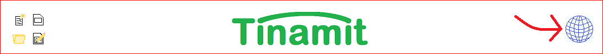

Cómo se emplea Tinamit
======================

.. contents:: Contenido
   :depth: 3

Hay dos maneras de usar Tinamit. Si quieres hacerlo sin código cualquier, el IGU (Interfaz de Usuario Gráfico) es para ti.
Si prefieres hacerlo con unas pocas líneas de código (lo cual puede acelerar bastante tu trabajo si tienes muchas simulaciones
diferentes que quieres automatizar), entonces el IPA (Interfaz de Programación de Aplicaciones) es la mejor opción.

Al final, el IGU y el IPA hacen el mismo trabajo (el IGU tiene botones muy lindos para llamar las funciones del IPA de manera
automática).

Preparación pre-uso
-------------------
No importe cuál del IPA o el IGU eliges usar, hay unas acciones preparatorias de las cuales no podrás escaparte.

Preparación del modelo DS
^^^^^^^^^^^^^^^^^^^^^^^^^
Tendrás que preparar el modelo de dinámicas de los sistemas antes de poder conectarlo. Para VENSIM (por el momento, Tinamit
funciona con VENSIM solamente), primero hay que ir a cada variable en tu modelo VENSIM que quieres que pueda recibir valores 
desde el modelo biofísico y escoger “Gaming” como tipo de variable. Después, hay que publicar el modelo en formato .vpm.

Preparación del modelo biofísico
^^^^^^^^^^^^^^^^^^^^^^^^^^^^^^^^
Si ya existe una envoltura específica para el modelo biofísico, no tienes que hacer nada más. Si no está disponible ya, tendrás
que escribir una (o convencer a alguien de hacerlo para ti). Otra parte de este manual (que todavía no he escrito) te explicará 
cómo hacer esto.

El IGU
------
Para los que no quieren programar, el IGU ofrece una manera sencilla de acceder (casi) todas las funcionalidades del IPA 
Tinamit, y algunas adicionales.

Cambiar idiomas
^^^^^^^^^^^^^^^
Bueno, primero, de pronto no hables español. O posiblemente trabajas con gente que no lo habla, y quieres hacerles la cortesía 
de trabajar en su idioma. O tal vez quieres practicar un idioma que no has hablado por mucho tiempo.

Mientras que el código de Tinamit sí mismo es en español, el interfaz de Tinamit está disponible en muchos idiomas (y siempre 
puedes agregar un nuevo).

Para cambiar idiomas, hacer clic en el icono del globo terrestre.

En el centro, tienes las lenguas ya traducidas. Puedes escoger una con la cajita verde a la izquierda, o pulsar en lapicito 
para hacer cambios a la traducción.

A la izquierda, tienes lenguas en progreso. La barra muestra el estado del progreso de la traducción. Puedes escoger una como 
lengua de interfaz; las traducciones que faltan aparecerán como espacios vacíos. También puedes hacer clic en el lapicito para 
contribuir a la traducción.

Y, por fin, a la derecha tienes lenguas que todavía no hemos empezado a traducir. Puedes hacer clic en el lápiz para empezar 
la traducción. También puedes hacer clic en la cruz arriba para agregar un nuevo idioma que no se encuentra en la lista ya (y
también especificar si se escribe de la izquierda hacia la derecha o al revés).

Todas las traducciones se guardan automáticamente en un documento llamado “Trads” en el directorio de Tinamit. Si contribuyes
a unas traducciones, puedes compartir este documento (|correo|, o por `GitHub <|GitHub|>`_) para que todas tengan acceso
a tu idioma favorito.

Cargar modelos (I)
^^^^^^^^^^^^^^^^^^
El flujo de trabajo en Tinamit tiene cuatro etapas (en números mayas) y el interfaz desbloquea el acceso a cada etapa en 
cuanto termines la etapa precedente.

La primera etapa sería, por supuesto, de cargar los modelos biofísicos y DS con :guilabel:`Cargar MDS` y
:guilabel:`Cargar modelo biofísico`.

.. image:: Cargar_modelos_tinamit.png
   :scale: 90 %
   :align: center
   :alt: Cargar modelos en Tinamit.

Conectar modelos (II)
^^^^^^^^^^^^^^^^^^^^^
Después de eso, vamos a conectar los dos modelos por sus variables comunes. La flecha muestra la dirección de la conexión, y 
puedes especificar un factor de conversión, si quieres. Hay que hacer clic en :guilabel:`Guardar` cada vez que haces una conexión.

.. image:: Tinamit_conectar_vars.png
   :scale: 90 %
   :align: center
   :alt: Conectar variables en Tinamit.

Si haces un error, puedes volver a editar una conexión ya hecha por hacer clic en el lapicito verde, o simplemente borrarla
con la cruz roja. Nota que el interfaz no te dejará conectar un variable más que una vez al mismo tiempo (eso sería una falla
lógica en la conexión de los dos modelos).

.. image:: IGU_editar_conexión.png
   :scale: 90 %
   :align: center
   :alt: Cambiar la conexión de variables en Tinamit.

Simular (III)
^^^^^^^^^^^^^
Ya puedes simular los modelos conectados. Puedes especificar el paso y el tiempo final de la simulación. Finalmente, puedes 
especificar un factor de conversión entre el paso de cada modelo si los dos modelos no tienen las mismas unidades para sus 
pasos de tiempo (por ejemplo, si tu modelo DS funciona en meses y tu modelo biofísico en años, lo cual sería una situación 
muy común).

Incertidumbre (IV)
^^^^^^^^^^^^^^^^^^
Un día, en el futuro, Tinamit tendrá unas funciones de autocalibración y de análisis de incertidumbre. Entre tanto, la página
para esta cuarta etapa queda un blanco muy bonito.

Guardar y cargar modelos conectados
^^^^^^^^^^^^^^^^^^^^^^^^^^^^^^^^^^^
Ah, sí, ¿qué pasa si no terminas todo antes del almuerzo? No te preocupes, que no vas a perder todo. Allí, arriba por a la
izquierda del logo muy bonito de Tinamit, hay cuatro botones muy útiles. Uno guarda tu trabajo, uno lo guarda bajo un nuevo
nombre, otro abre un trabajo ya guardado y el último borra todo y te deja empezar de cero. No te voy a decir cuál es cuál.

El IPA
------
El IPA (interfaz de programación de aplicaciones) permite conectar modelos de manera rápida, flexible, y reproducible. Tiene
las mismas funciones que el IGU, pero por ser una librería Python ya puedes automatizar el proceso. Si prefieres escribir 
líneas de código a hacer clic en botones, el IPA es para ti.

Preparar todo
^^^^^^^^^^^^^
Antes que todo, hay que importar los objetos de Tinamit que vamos a necesitar:

  ``from Conectado import Conectado``

Esta línea importa la clase Conectado del módulo Conectado de Tinamit. Increíblemente, es la única cosa que tenemos que importar.

Cargar modelos
^^^^^^^^^^^^^^
Primero, vamos a empezar por crear una instancia de la clase Conectado. Si no sabes lo que es una instancia de una clase, o 
puedes simplemente copiar el texto abajo, o (mejor) puedes echarle otro vistazo a tu último curso en Python.

  ``modelo = Conectado()``

¿Pero cómo especificamos cuáles modelos biofísico y DS querremos? Esto se hace en la línea siguiente:

  ``modelo.estab_mds("C:\\Yo\\MisArchivos\\MiModeloVENSIM.vpm")``

estab_mds, como probablemente adivinaste, establece el modelo DS. Le tienes que dar como argumento la ubicación del archivo 
.vpm de tu modelo DS publicado por VENSIM. En el futuro, si Tinamit puede aceptar modelos de otros programas que VENSIM, podrás 
poner otros tipos de archivos aquí. (Notar que habrá que cambiar la ubicación aquí según tú computadora.)

Y, para el modelo biofísico, especificamos la ubicación de la envoltura específica para el modelo biofísico que querremos usar. 
En este caso, vamos a usar SAHYSMOD, un modelo de flujos de agua subterránea y de salinidad. Esto no cambia mucho; cada vez que 
quieres conectar un modelo DS con un modelo en SAHYSMOD darás la misma envoltura, no importe cuáles variables estás conectando.

  ``modelo.estab_bf(os.path.join(os.path.split(__file__)[0], 'mi_envoltura.py'))``

(No te preocupes por lo del ``os.path.split(__file__)[0]``, es simplemente una manera en Python de obtener la dirección en tu 
computadora del directorio actual. Esto le permite al programa encontrar la envoltura para el modelo biofísico, no 
importe dónde lo guardará alguién en su computadora)

Conectar Variables
^^^^^^^^^^^^^^^^^^
Ahora, vamos a conectar los dos modelos por crear enlaces entre los variables de cada uno. Cada conexión entre dos variables 
necesita 3 cosas: los nombres de los dos variables para conectar y la dirección de la conexión (es dec
ir, de cuál modelo sacas el valor del variable para ponerlo en el otro modelo). Una simulación verdaderamente dinámica incluirá 
conexiones en ambas direcciones (del modelo DS al biofísico y viceversa).

  ``modelo.conectar(var_mds='Salinidad', mds_fuente=False, var_bf="Cr4 - Salinidad")``
  
``var_mds`` es el nombre del variable en el modelo DS, y ``var_bf`` es el nombre del variable en el modelo biofísico (tal como 
especificado en la envoltura). ``mds_fuente`` indica si se lee el valor del variable en el modelo DS para transferirla al
modelo biofísico, o si es al revés. En este ejemplo, tomamos el valor de la salinidad del suelo del modelo SAHYSMOD y lo pasamos al modelo DS (VENSIM).

Opcionalmente, puedes especificar el parámetro ``conv``, un factor de conversión (si los dos variables tienen unidades 
distintas). Puedes conectar tantos variables como quieras. En nuestro ejemplo de SAHYSMOD que viene con Tinamit, conectamos un 
total de 8 variables.

Simular
^^^^^^^
Ya, por fin, podemos simular el modelo:

  ``modelo.simular(paso=1, tiempo_final=240, nombre_simul='Mi primera simulación Tinamit')``
  
``paso`` indica el intervalo de tiempo al cual se intercambian valores de variables entre los dos modelos. ``tiempo_final`` 
indica la duración de la simulación, y ``nombre_simul`` es el nombre de la simulación que se dará al archivo con los egresos 
(resultados) de la simulación.

Implementación de políticas
^^^^^^^^^^^^^^^^^^^^^^^^^^^
Los que conocen los modelos de dinámicas de los sistemas sabrán que muchas veces se incorporan opciones de acciones o de 
políticas en los modelos con un variable “sí o no.” Por ejemplo, en nuestro modelo de salinidad de los suelos tenemos un 
variable llamado “Política de recuperación de aguas.” Si este variable es igual a 1, activará la parte del modelo de dinámicas 
de los sistemas para una política de recuperación de aguas. Si es igual a 0, no habrá intervención en la simulación. Estas 
cosas son muy útiles para comprobar la eficacidad (o no) de varias ideas de intervenciones en el sistema.

El asunto es que nosotros nos aburrimos muy rápido de tener que cambiar los valores de estos variables en el modelo VENSIM y 
tener que volver a publicarlo cada vez que querríamos analizar una combinación diferente de políticas. Con 5 posibilidades de 
políticas distintas en nuestro modelo ejemplo, ¡acabamos con muchas combinaciones y permutaciones!

Así que no se preocupen, ya incluimos una función en el IPA que les permite activar o desactivar una política en particular si 
tener que abrir VENSIM y republicar el modelo para cada cambio. Actualmente, puedes emplear esta función para cambiar el valor 
de cualquier variable en el modelo antes de empezar la simulación, pero es más útil que todo para activar y desactivar 
políticas. (¡Cuidado! Esta función solamente cambia el valor inicial del variable.)

  ``modelo.mds.cambiar_var(var=”Política maravillosa”, val=1)``
  
``modelo.mds`` accede al objeto de modelo DS asociado con el modelo conectado, y la función ``.cambiar_var()`` hace exactamente 
lo que piensas que hace.

Resumen
^^^^^^^
Y bueno, allí está. Ya puedes conectar, desconectar, simular y manipular modelos. Mira el documento “Ejemplo SAHYSMOD” en el 
directorio de ejemplos de Tinamit para un ejemplo del uso del IPA en la automatización de corridas para simular, de una vez, 5 
corridas de un modelo socioeconómico DS con un modelo biofísico de calidad y salinidad de los suelos (SAHYSMOD).

Para las que conocen las funciones :py:mod:`threading` de Python, y que piensan que sería una manera brillante de correr las 
5 simulaciones en paralelo para ahorrar tiempo, no lo hagan. Pensamos lo mismo y cuando lo intentamos sucede que el DLL de 
VENSIM no puede correr más que un modelo al mismo tiempo y se pone en un gran lío. Si no tienes ni idea de lo que estoy 
diciendo, perfecto.
