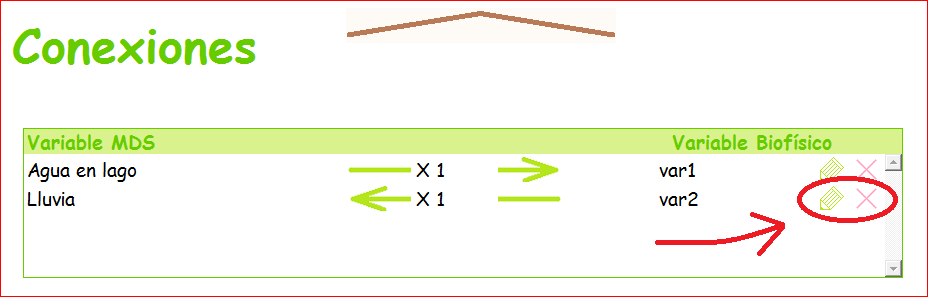

.. _IGU:

El IGU
======
Para los que no quieren programar, el IGU ofrece una manera sencilla de acceder (casi) todas las funcionalidades del IPA 
Tinamït, y algunas adicionales.

.. contents:: Contenido
   :depth: 3

Empezar el IGU
--------------
Se empieza el interfaz con la función ``correr`` del IGU::

   from tinamit.Interfaz.IGU import correr
   correr()

También simplemente puedes directamente ejecutar el archivo ``tinamit.Interfaz.IGU`` desde Python.

Cambiar idiomas
---------------
Bueno, primero, de pronto no hables español. O posiblemente trabajas con gente que no lo habla, y quieres hacerles la cortesía 
de trabajar en su idioma. O tal vez quieres practicar un idioma que no has hablado por mucho tiempo.

Mientras que el código de Tinamït sí mismo es en español, el interfaz de Tinamït está disponible en muchos idiomas (y siempre
puedes agregar un nuevo).

Para cambiar idiomas, hacer clic en el icono del globo terrestre.

.. image:: ../imágenes/IGU/IGU_cabeza_globo.png
   :align: center
   :alt: Icono de cambio de idiomas de Tinamït.

Lo cual te dará...

.. image:: ../imágenes/IGU/IGU_trads.png
   :align: center
   :alt: Página de traducción de idiomas de Tinamït.

En el centro, tienes las lenguas ya traducidas. Puedes escoger una con la cajita verde a la izquierda, o pulsar en lapicito 
para hacer cambios a la traducción.

A la izquierda, tienes lenguas en progreso. La barra muestra el estado del progreso de la traducción. Puedes escoger una como 
lengua de interfaz; las traducciones que faltan aparecerán como espacios vacíos. También puedes hacer clic en el lapicito para 
contribuir a la traducción.

Y, por fin, a la derecha tienes lenguas que todavía no hemos empezado a traducir. Puedes hacer clic en el lápiz para empezar 
la traducción. También puedes hacer clic en la cruz arriba para agregar un nuevo idioma que no se encuentra en la lista ya (y
también especificar si se escribe de la izquierda hacia la derecha o al revés).

Todas las traducciones se guardan automáticamente en un documento llamado “Trads” en el directorio de Tinamït. Si contribuyes
a unas traducciones, puedes compartir este documento (|correo|, o por `GitHub`_) para que todas tengan acceso
a tu idioma favorito.

Cargar modelos (I)
------------------
El flujo de trabajo en Tinamït tiene cuatro etapas (en números mayas) y el interfaz desbloquea el acceso a cada etapa en
cuanto termines la etapa precedente.

La primera etapa sería, por supuesto, de cargar los modelos biofísicos y DS con :guilabel:`Cargar MDS` y
:guilabel:`Cargar modelo biofísico`.

.. image:: ../imágenes/IGU/IGU_cargar_modelos.png
   :align: center
   :alt: Cargar modelos en Tinamït.

Conectar modelos (II)
---------------------
Después de eso, vamos a conectar los dos modelos por sus variables comunes. La flecha muestra la dirección de la conexión, y 
puedes especificar un factor de conversión, si quieres. Hay que hacer clic en :guilabel:`Guardar` cada vez que haces una conexión.

.. image:: ../imágenes/IGU/IGU_conectar_vars.png
   :align: center
   :alt: Conectar variables en Tinamït.

Si haces un error, puedes volver a editar una conexión ya hecha por hacer clic en el lapicito verde, o simplemente borrarla
con la cruz roja. Nota que el interfaz no te dejará conectar un variable más que una vez al mismo tiempo (eso sería una falla
lógica en la conexión de los dos modelos).

Simular (III)
-------------
Ya puedes simular los modelos conectados. Puedes especificar el paso y el tiempo final de la simulación. Finalmente, puedes 
especificar un factor de conversión entre el paso de cada modelo si los dos modelos no tienen las mismas unidades para sus 
pasos de tiempo (por ejemplo, si tu modelo DS funciona en meses y tu modelo biofísico en años, lo cual sería una situación 
muy común).

Incertidumbre (IV)
------------------
Un día, en el futuro, Tinamït tendrá unas funciones de autocalibración y de análisis de incertidumbre. Entre tanto, la página
para esta cuarta etapa queda un blanco muy bonito.

Guardar y cargar modelos conectados
-----------------------------------
Ah, sí, ¿qué pasa si no terminas todo antes del almuerzo? No te preocupes, que no vas a perder todo. Allí, arriba por a la
izquierda del logo muy bonito de Tinamït, hay cuatro botones muy útiles. Uno guarda tu trabajo, uno lo guarda bajo un nuevo
nombre, otro abre un trabajo ya guardado y el último borra todo y te deja empezar de cero. No te voy a decir cuál es cuál.

.. image:: ../imágenes/IGU/IGU_cabeza_archivos.png
   :align: center
   :alt: Acciones de archivo en Tinamït.
